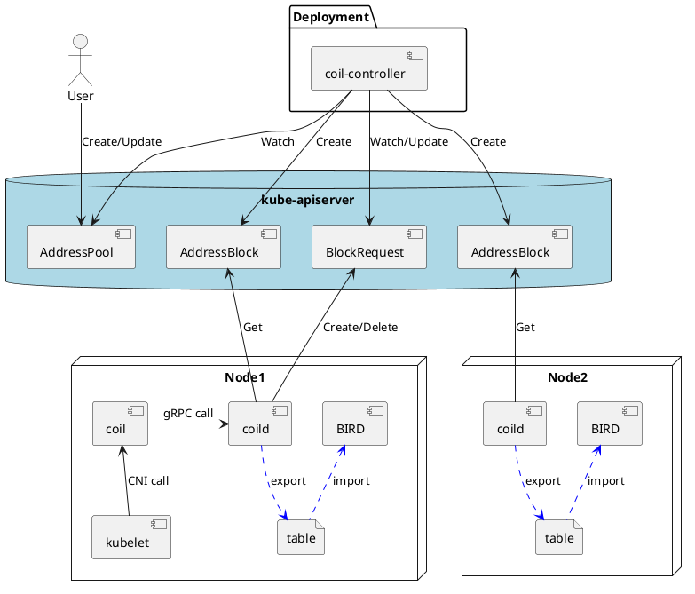
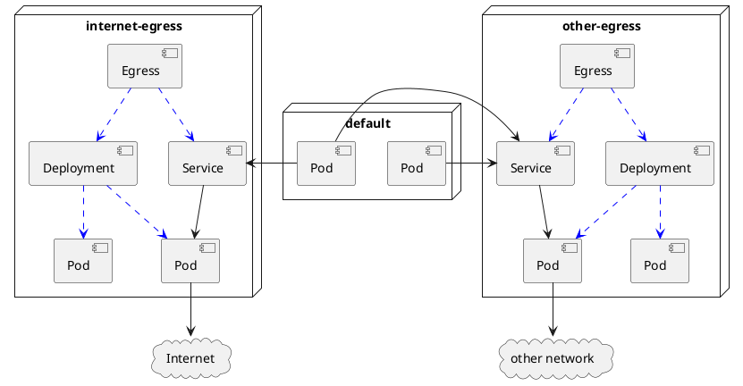

Design notes for Coil v2
========================

- [Overview](#overview)
  - [Background](#background)
  - [Goals](#goals)
  - [Planned features](#planned-features)
- [Programs](#programs)
- [IP Address Management (IPAM)](#ip-address-management-ipam)
  - [Address pools](#address-pools)
  - [Choosing the pool](#choosing-the-pool)
  - [Address blocks](#address-blocks)
  - [How `coild` manages IP address assignments](#how-coild-manages-ip-address-assignments)
- [Routing](#routing)
  - [Intra-node routing](#intra-node-routing)
  - [Inter-node routing](#inter-node-routing)
- [On-demand NAT for egress traffics](#on-demand-nat-for-egress-traffics)
  - [Router pods](#router-pods)
  - [Foo-over-UDP tunnel](#foo-over-udp-tunnel)
  - [Bidirectional tunneling](#bidirectional-tunneling)
  - [Working with Service](#working-with-service)
  - [Session persistence](#session-persistence)
  - [Auto-scaling with HPA](#auto-scaling-with-hpa)
  - [Implementation](#implementation)
- [Garbage Collection](#garbage-collection)
  - [AddressBlock](#addressblock)
  - [BlockRequest](#blockrequest)
- [Upgrading from v1](#upgrading-from-v1)
- [Diagrams](#diagrams)
  - [IPAM & Routing](#ipam--routing)
  - [On-demand NAT for Egress Traffics](#on-demand-nat-for-egress-traffics-1)
- [Custom Resource Definitions (CRDs)](#custom-resource-definitions-crds)
  - [AddressPool](#addresspool)
  - [AddressBlock](#addressblock-1)
  - [BlockRequest](#blockrequest-1)
  - [Egress](#egress)

## Overview

Coil is a [CNI][] plugin for Kubernetes.  It is designed with modularity and performance in mind.
This document describes the background and goals of the version 2 of Coil.

### Background

Coil v1 was our first attempt to create something for Kubernetes.
When we started to create Coil, we did not know how to create [operators][], how to elect a leader controller, nor how to expose metrics for Prometheus.

Now that we have learned how to do these things, and want to add rich features such as on-demand NAT for egress traffics, it is the time to revamp the implementation.

### Goals

- Use CRD to configure Coil instead of CLI tool `coilctl`.
- Store status data in `kube-apiserver` instead of etcd.
- Decouple the pool name and namespace name.  Use annotations to specify the pool to be used.
- Use gRPC instead of REST for local inter-process communication.
- Use CRD for communication between the controller and the node pods.
- Use leader-election of the controller for better availability.
- Export Prometheus metrics.  Specifically, usage stats of the address pools.
- Add on-demand NAT for egress traffics.
- Keep the rest of the v1 architecture and concepts.

### Planned features

- IP address management (IPAM)
- Multiple pools of IP addresses
- Intra-node routing
- Loose coupling with external routing program
- On-demand NAT for egress traffics using [Foo over UDP][FOU]
- Exporting metrics for [Prometheus][]

## Programs

Coil v2 will consist of the following programs:

- `coil-controller`: Kubernetes controller managing custom resources.
- `coild`: Daemon program running on nodes.
- `coil`: CNI interface that delegates requests from `kubelet` to `coild`.
- `coil-egress`: Administration program running in Egress pods.

## IP Address Management (IPAM)

### Address pools

To assign IP addresses to pods, coil has pools of IP addresses.
Each pod can request an IP address assignment from a single pool.
For example, a pod may request a globally routable IP address from a pool of global IP addresses.

### Choosing the pool

Choosing the pool should be controlled carefully by the cluster admins.
If a user can freely choose the pool of global IP addresses, the user could easily consume the limited addresses or expose the pod to the Internet without protection.

Therefore, there is at most one _default_ pool that should have non-global IP addresses.
To use non-default pools, the admins should add an annotation to the namespace of the pod.
The annotation value should the name of the pool that is used to assign IP addresses to the pods in the namespace.

To make things simple, the default pool is the pool whose name is `default`.

### Address blocks

To reduce the number of advertised routes, addresses in an address pool are divided into fixed-size blocks.
These blocks are called _address blocks_, and assigned to nodes.  Since all IP addresses in an address block are routed to the same node, only one route per address block need to be advertised.

For example, if an address pool defines that the size of an address block is 2<sup>5</sup>, `coil-controller` will curve an address block for IPv4 with `/27` subnet mask out of the pool, and assigns it to a node.

### How `coild` manages IP address assignments

`coild` picks up a free IP address from an address block, assigns it to a pod.

To make things fast, `coild` builds an in-memory cache of allocated IP addresses by scanning the host OS network namespace at startup.

The basic flow looks like:

1. Receive an assignment request from `coil` via gRPC over UNIX domain socket.
2. Determine which pool should be chosen for the pod.
3. If the node has an address block with free IP addresses of the pool, skip to 5.
4. Request and wait assignment of a new address block of the pool.
5. Pick a free IP address out of the block.
6. Return the picked address to `coil`.

## Routing

Coil programs only intra-node routing between node OS and pods on the node.
As to inter-node routing, coil exports routing information to an external routing daemon such as [BIRD][].

This design allows users to choose the routing daemon and protocol on their demands.

### Intra-node routing

For each pod running on a node, `coil` creates a [veth][] pair.  One end of the pair becomes `eth0` interface of pod containers, and the other end is used in the host OS.

In the host OS network namespace, `coil` inserts an entry into the kernel routing table to route packets to the pod.  It also assigns a link-local address to the host-side end of veth.  For IPv4, the address is `169.254.1.1`.

In the pod network namespace, `coil` inserts the default gateway like this:

```
ip route add 169.254.1.1/32 dev eth0 scope link
ip route add default via 169.254.1.1 scope global
```

Coil does not use the [bridge][] virtual interface.

### Inter-node routing

For each allocated address block, `coild` inserts a route into an unused kernel routing table.

This table can be referenced by an external routing program such as [BIRD][].
Users can configure the external program to advertise the routes with the protocol of their choice.

## On-demand NAT for egress traffics

In environments where nodes and pods only have private IP addresses, communication to the external networks requires source network address translation (SNAT).  If the underlying network provides SNAT, there is no problem.
But if not, we need to somehow implement SNAT on Kubernetes.

Coil provides a feature to implement SNAT routers on Kubernetes for these kind of environments.
This feature is on-demand because admins can allow only a subset of pods to use SNAT routers.

### Router pods

SNAT routers can be created in the following steps:

1. Prepare an address pool whose IP addresses can communicate with one (or more) external networks.
2. Prepare a namespace associated with the address pool.
3. Run pods in the namespace.  These pods work as SNAT routers.
4. Configure iptables rules in the router pods for SNAT.

The iptables rule looks like:

```
iptables -t nat -A POSTROUTING ! -s <pod address>/32 -o eth0 -j MASQUERADE
```

### Foo-over-UDP tunnel

Since the underlay network cannot route packets whose destination addresses are in the external network(s),
the remaining problem is how to route packets originated from client pods to router pods.  The solution is to use [tunnels](https://developers.redhat.com/blog/2019/05/17/an-introduction-to-linux-virtual-interfaces-tunnels/).

Linux has a number of tunneling options.  Among others, we choose [Foo over UDP (FoU)](https://lwn.net/Articles/614348/) because it has good properties:

- FoU encapsulates packets in UDP.
    - UDP packets can be processed efficiently in modern network peripherals.
    - UDP servers can be made redundant with Kubernetes' [Service][].
- FoU can tunnel both IPv4 and IPv6 packets.

#### How FoU works

FoU encapsulates other IP-based tunneling protocol packet into a UDP packet.
The most simple pattern is to encapsulate [IP in IP (IPIP)](https://en.wikipedia.org/wiki/IP_in_IP) packets.

This can be configured by 1) creating IPIP tunnel device with FoU encapsulation option, and 2) adding FoU listening port as follows:

```console
$ sudo ip link add name tun1 type ipip ttl 225 \
    remote 1.2.3.4 local 5.6.7.8 \
    encap fou encap-sport 5555 encap-dport 5555

$ sudo ip fou add port 5555 ipproto 4    # 4 means IPIP protocol
```

To send an FoU encapsulated packet to an external network `11.22.33.0/24` via the SNAT router `1.2.3.4`, the packet need to be routed to `tun1` link.  This can be done by, for example, `ip route add 11.22.33.0/24 dev tun1`.

To receive an FoU packet, the packet needs to be delivered to the port 5555.  The kernel then strips FoU header from the packet and try to find a matching IPIP link because of `ipproto 4`.  If no matching IPIP link is found, the packet will be dropped.  If found, the encapsulated body of the packet will be processed.

For tunneling IPv6 packets over IPv6, the protocol number needs to be changed from `4` to `41` and the link type from `ipip` to `ip6tnl` with `mode ip6ip6`.

### Bidirectional tunneling

The transmission between client pods and the SNAT router needs to be bidirectional because otherwise packets returning from the external network via SNAT router to the client may not reach the final destination for the following reasons.

- The returning packet's source address can be a global IP address, and such packets are often rejected by NetworkPolicy.
- If the packet is TCP's SYN-ACK, it is often dropped by the underlay network because there seems no corresponding SYN packet.  Note that SYN packet was sent through FoU tunnel.

### Working with Service

If the SNAT routers are behind Kubernetes Service, the IPIP tunnel on the client pod is configured to send packets to the Service's ClusterIP.  Therefore, the FoU encapsulated packet will have the ClusterIP as the destination address.

Remember we need bidirectional tunneling.  If the returning packet has the SNAT router's IP address as the source address, the packet does not match the IPIP tunnel configured for the Service's ClusterIP.  So, the returning packet *must* have the ClusterIP as the source address.

To resolve this, we need to understand how `kube-proxy` works for ClusterIP.  `kube-proxy` rewrites outgoing packets' destination addresses if they are ClusterIP.  So, it works as a destination NAT (DNAT) service.

Moreover, it rewrites the incoming packet's source addresses if the packet seems like a response returned from one of the destination servers of Service.  To be more precise, the incoming packet will be handled by `kube-proxy` if and only if its destination address/port was the source address/port of the outgoing packet and its source address/port was the destination address/port.

To satisfy this condition, we use the port number 5555 for FoU on both client pods and SNAT router pods.

### Session persistence

To tunnel TCP packets, we need to keep sending the packets to the same SNAT router.
This can be achieved by setting Service's [`spec.sessionAffinity`](https://kubernetes.io/docs/reference/generated/kubernetes-api/v1.18/#servicespec-v1-core) to `ClientIP`.

One subtle problem of this is that the affinity can't be kept forever.

- For `kube-proxy` running in iptables mode, this can be changed through `net.netfilter.nf_conntrack_udp_timeout_stream` sysctl value.
- For `kube-proxy` running in IPVS mode, this can be changed through `net.ipv4.vs.timeout_udp` sysctl value.

If `kube-proxy` runs in IPVS mode, we have an alternative method to keep sessions; use source-hash (`sh`) scheduling algorithm.  This can be done by giving `--ipvs-scheduler=sh` option to `kube-proxy`.

### Auto-scaling with HPA

To enable auto-scaling with horizontal pod autoscaler (HPA), `Egress` implements `scale` subresource.

- [Scale subresource](https://kubernetes.io/docs/tasks/extend-kubernetes/custom-resources/custom-resource-definitions/#scale-subresource)
- [Autoscaling Kubernetes Custom Resource using the HPA](https://medium.com/@thescott111/957d00bb7993)

### Implementation

On-demand NAT for egress traffics is implemented with a CRD called `Egress`.
`Egress` is a namespace resource.  It will create a `Deployment` and `Service` to run router pods in the same namespace.

In each router pod, `coil-egress` runs to maintain FoU tunnels connected to its client pods.

For client pods, a special annotation `coil.cybozu.com/egress` tells Coil to setup FoU tunnels for the given `Egress` networks.
The annotation key is `egress.coil.cybozu.com/NAMESPACE`, where `NAMESPACE` is the namespace of `Egress`.
The annotation value is a comma-separated list `Egress` names.

```yaml
apiVersion: v1
kind: Pod
metadata:
  annotations:
    egress.coil.cybozu.com/internet: egress
    egress.coil.cybozu.com/other-net: egress
```

An `Egress` has a list of external network addresses.  Client pods that want to send packets to these networks should include the `Egress` name in the annotation.

In a client pod, IP policy routing is setup as follows.

```
# IPv4 link local addresses must be excluded from this feature.
ip rule add to 169.254.0.0/16 pref 1800 table main

# Specific NAT destinations are registered in table 117.
ip rule add pref 1900 table 117

# IPv4 private network addresses.
ip rule add to 192.168.0.0/16 pref 2000 table main
ip rule add to 172.16.0.0/12 pref 2001 table main
ip rule add to 10.0.0.0/8 pref 2002 table main

# SNAT for 0.0.0.0/0 (tun1) must come last.
ip rule add pref 2100 table 118
ip route add default dev tun1 table 118
```

## Garbage Collection

To understand this section, you need to know the Kubernetes garbage collection and finalizers.
If you don't know much, read the following materials:

- [Garbage Collection](https://kubernetes.io/docs/concepts/workloads/controllers/garbage-collection/)
- [Using Finalizers](https://book.kubebuilder.io/reference/using-finalizers.html)

### AddressBlock

**The owner reference of an `AddressBlock` is set to the `AddressPool`** from which the block was allocated.
Therefore, when the owning `AddressPool` is deleted, all `AddressBlocks` from the pool is garbage collected automatically by Kubernetes.

That said, an `AddressBlock` should not be deleted until there are no more Pods with an address in the block.
For this purpose, Coil adds a finalizer to each `AddressBlock`.  **`coild` checks the usage of addresses in the block**, and once there are no more Pods using the addresses, it removes the finalizer to delete the `AddressBlock`.

`AddressBlock` should also be deleted when `Node` that acquired the block is deleted.  Since `coild` running as a DaemonSet pod cannot do this, **`coil-controller` watches Node deletions and removes `AddressBlocks`**.  `coil-controller` periodically checks dangling `AddressBlocks` and removes them.

`coild` also deletes `AddressBlock` when it frees the last IP address used in the block.  At startup, `coild` also checks each `AddressBlock` for the Node, and if no Pod is using the addresses in the block, it deletes the `AddressBlock`.

Note that Coil does not include `Node` in the list of owner references of an `AddressBlock`.  This is because Kubernetes only deletes a resource after _all_ owners in the owner references of the resource are deleted.

### BlockRequest

Normally, `coild` is responsible to delete `BlockRequest` created by itself.

In case that `Node` where `coild` is running is deleted, Coil adds the node into the `BlockRequest`'s owner references.  This way, Kubernetes will collect orphaned `BlockRequest`s.

## Upgrading from v1

We will prepare a converter program that reads Coil v1 data from etcd and converts them to YAML manifests for Coil v2.

The upgrade is done through the following steps:

1. Remove Coil v1 resources from Kubernetes.  This stops updating data in etcd.
2. Run the converter and save the generated manifests as `data.yaml`.
3. (option) Add annotations to namespaces to specify `AddressPool`.
4. Apply Coil v2 CRDs.
5. Apply `data.yaml`.
6. Apply other Coil v2 resources.

## Diagrams

### IPAM & Routing


<!--

-->

### On-demand NAT for Egress Traffics


<!--

-->

## Custom Resource Definitions (CRDs)

Coil v2 will define and use the following custom resources:

- `AddressPool`: An address pool is a set of IP subnets.
- `AddressBlock`: A block of IP addresses carved out of a pool.
- `BlockRequest`: Each node uses this to request an assignment of a new address block.
- `Egress`: represents an egress gateway for on-demand NAT feature.

These YAML snippets are intended to hint the implementation of Coil CRDs.

### AddressPool

```yaml
apiVersion: coil.cybozu.com/v2
kind: AddressPool
metadata:
  name: pool1
spec:
  blockSizeBits: 5
  subnets:
    - ipv4: 10.2.0.0/16
      ipv6: fd01:0203:0405:0607::/112
```

### AddressBlock

```yaml
apiVersion: coil.cybozu.com/v2
kind: AddressBlock
metadata:
  name: pool1-NNN
  labels:
    coil.cybozu.com/pool: pool1
    coil.cybozu.com/node: node1
  finalizers: ["coil.cybozu.com"]
  ownerReferences:
  - apiVersion: coil.cybozu.com/v2
    controller: true
    blockOwnerDeletion: true
    kind: AddressPool
    name: pool1
    uid: d9607e19-f88f-11e6-a518-42010a800195
index: 16
ipv4: 10.2.2.0/27
ipv6: fd01:0203:0405:0607::0200/123
```

### BlockRequest

```yaml
apiVersion: coil.cybozu.com/v2
kind: BlockRequest
metadata:
  name: <random name>
  ownerReferences:
  - apiVersion: v1
    controller: false
    blockOwnerDeletion: false
    kind: Node
    name: node1
    uid: d9607e19-f88f-11e6-a518-42010a800195
spec:
  nodeName: node1
  poolName: pool1
status:
  addressBlockName: pool1-NNN
  conditions:
    - type: Complete # or Failed
      status: True   # or False or Unknown
      reason: "reason of the error"
      message: "a human readable message"
```

### Egress

Egress generates a Deployment and a Service.
So it has fields to customize them.

To support auto scaling by HPA, it has some status fields for it.

```yaml
apiVersion: coil.cybozu.com/v2
kind: Egress
metadata:
  name: internet
  namespace: internet-egress
spec:
  destinations:
    - 0.0.0.0/0
  replicas: 2
  strategy:
    type: Recreate
  template:
    metadata:
      annotations:
        foo: bar
      labels:
        name: coil-egress
      spec:
        affinity:
          podAntiAffinity:
            requiredDuringSchedulingIgnoredDuringExecution:
            - labelSelector:
                matchLabels:
                  name: coil-egress
              topologyKey: topology.kubernetes.io/zone
  sessionAffinity: ClientIP
  sessionAffinityConfig:
    clientIP:
      timeoutSeconds: 43200  # 12 hours
status:
  replicas: 1
  selector: "coil.cybozu.com%2Fname=internet"
```

[CNI]: https://github.com/containernetworking/cni
[operators]: https://kubernetes.io/docs/concepts/extend-kubernetes/operator/
[FOU]: https://lwn.net/Articles/614348/
[Service]: https://kubernetes.io/docs/concepts/services-networking/service/
[Prometheus]: https://prometheus.io/
[CRD]: https://kubernetes.io/docs/tasks/access-kubernetes-api/custom-resources/custom-resource-definitions/
[model]: https://kubernetes.io/docs/concepts/cluster-administration/networking/#the-kubernetes-network-model
[Calico]: https://www.projectcalico.org/
[kube-router]: https://github.com/cloudnativelabs/kube-router
[BIRD]: https://bird.network.cz/
[BGP]: https://en.wikipedia.org/wiki/Border_Gateway_Protocol
[veth]: https://developers.redhat.com/blog/2018/10/22/introduction-to-linux-interfaces-for-virtual-networking/#veth
[bridge]: https://goyalankit.com/blog/linux-bridge
