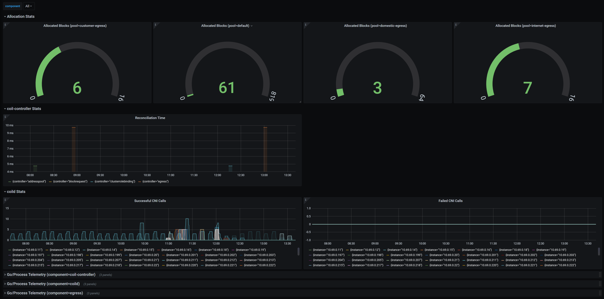

User manual
===========

This document describes how to use Coil features.
Coil is a Kubernetes-native application and can be controlled with `kubectl`.

For installation, read [setup.md](setup.md).

- [User manual](#user-manual)
  - [Admin role](#admin-role)
  - [Address pools](#address-pools)
    - [AddressPool custom resource](#addresspool-custom-resource)
    - [The default pool](#the-default-pool)
    - [Using non-default pools](#using-non-default-pools)
    - [Adding addresses to a pool](#adding-addresses-to-a-pool)
  - [Address blocks](#address-blocks)
    - [Importing address blocks as routes](#importing-address-blocks-as-routes)
  - [Egress NAT](#egress-nat)
    - [How it works](#how-it-works)
    - [Egress custom resource](#egress-custom-resource)
    - [Client Pods](#client-pods)
    - [Use NetworkPolicy to prohibit NAT usage](#use-networkpolicy-to-prohibit-nat-usage)
    - [Session affinity](#session-affinity)
    - [Use egress only for connections originating on the client](#use-egress-only-for-connections-originating-on-the-client)
  - [Metrics](#metrics)
    - [How to scrape metrics](#how-to-scrape-metrics)
    - [Dashboards](#dashboards)

## Admin role

By default, no one but the cluster administrator can edit the custom resources
of Coil.  Everyone can view the custom resources.

If you want to allow someone or some group to edit them, define the roles
and role bindings you need.

## Address pools

### AddressPool custom resource

`AddressPool` is a cluster-scope custom resource of Coil.
Pods in a namespace are assigned their IP addresses from an address pool.

Here is an example address pool:

```yaml
apiVersion: coil.cybozu.com/v2
kind: AddressPool
metadata:
  name: default
spec:
  blockSizeBits: 5
  subnets:
    - ipv4: 10.2.0.0/16
      ipv6: fd01:0203:0405:0607::/112
```

`blockSizeBits` specifies the size of an address block that is carved from this pool.
The value `n` is interpreted as 2<sup>n</sup> addresses, so if the value is 5,
each address block of this pool will have 32 IP addresses.

The minimum allowed value of `blockSizeBits` is 0.
The default value of `blockSizeBits` is 5.

An address pool can be one of IPv4-only, IPv6-only, or dual stack type.
The type is determined by what family of addresses are included in `subnets`.

For IPv4-only pool, `subnets` can contain only IPv4 subnets.
For IPv6-only pool, `subnets` can contain only IPv6 subnets.
For dual stack pool, `subnets` must contain both IPv4 and IPv6 subnets.

IPv4 and IPv6 subnets must be the same size for dual stack pools.
In the above example, both subnets are 16 bits wide.

### The default pool

The address pool whose name is `default` becomes the default pool.

The default pool is used in all namespaces that do not specify which pool to use.

### Using non-default pools

You may define other address pools.
Non-default pools are used only if the namespace has `coil.cybozu.com/pool` annotation.

You can use `kubectl` to give the annotation to a namespace.
The following example makes Pods in namespace `foo` be assigned addresses from pool `bar`.

```console
$ kubectl annotate namespaces foo coil.cybozu.com/pool=bar
```

### Adding addresses to a pool

If a pool is running out of IP addresses, you can add more subnets.

```yaml
apiVersion: coil.cybozu.com/v2
kind: AddressPool
metadata:
  name: default
spec:
  blockSizeBits: 5
  subnets:
    - ipv4: 10.2.0.0/16
      ipv6: fd01:0203:0405:0607::/112
    - ipv4: 10.3.0.0/16
      ipv6: fd01:0203:0405:0608::/112
```

You cannot remove or edit subnets in the existing pools.

## Address blocks

As described, each node is assigned address blocks from address pools.
The assignment of address blocks can be checked by getting `AddressBlock` custom resource.

```console
$ kubectl get addressblocks
NAME        NODE                 POOL      IPV4             IPV6
default-0   coil-worker3         default   10.224.0.0/30
default-1   coil-control-plane   default   10.224.0.4/30
default-3   coil-worker3         default   10.224.0.12/30
```

Address blocks are automatically assigned and returned.
So usually you do not need to care about them.

### Importing address blocks as routes

Address blocks represent routes or subnets to be routed to their assigned nodes.

To help integrating Coil with router software such as [BIRD](https://bird.network.cz/),
Coil exports information of address blocks to a kernel routing table on each node.

The routing table ID is usually 119.
Run `ip route show table 119` or `ip -6 route show table 119` on a node to check it.

```console
# ip route show table 119
10.224.0.0/30 dev lo proto 30
10.224.0.12/30 dev lo proto 30
```

## Egress NAT

Coil can run some Pod as an egress NAT server and selectively allow other Pods
to become clients of the NAT server.  This feature is called _on-demand NAT for
egress traffics_, or shortly _Egress NAT_.

### How it works

It is common in data centers that only a specific subset of IP addresses can
be routed to external networks, such as the Internet.

If a pod has such a specific IP address and can accept packets from other pods,
the pod can work as a SNAT (source network address translation) server.

Coil implements this with the following setup:

1. Prepare an address pool for the specific subset of IP addresses
2. Prepare a namespace associated with the address pool
3. Create `Deployment` to run SNAT pods in the namespace
4. Create `Service` in the same namespace to make NAT servers redundant
5. Establish IP-over-IP tunnels between NAT clients and servers
6. Setup routing table of client pods to route packets to SNAT pods over the tunnel

Step 1 and 2 should be done by users.
Step 3 and 4 can be done by creating `Egress` custom resource in the namespace.
Step 5 and 6 are automatically done by Coil.

### Egress custom resource

`Egress` is a namespace-scoped custom resource of Coil.
It defines an egress portal of the cluster for some destinations.

Coil creates a `Deployment` and `Service` for each `Egress`.
It also creates a `PodDisruptionBudget` when `spec.podDisruptionBudget` is specified.

Here is an example `Egress` resource for the Internet:

```yaml
apiVersion: coil.cybozu.com/v2
kind: Egress
metadata:
  namespace: internet
  name: egress
spec:
  destinations:
  - 0.0.0.0/0
  replicas: 2
```

The next is another example for a private, external network with a lot of extra fields:

```yaml
apiVersion: coil.cybozu.com/v2
kind: Egress
metadata:
  namespace: other-network
  name: egress
spec:
  destinations:
  - 172.20.0.0/16
  - fd04::/64
  replicas: 3
  strategy:
    type: RollingUpdate
    rollingUpdate:
      maxUnavailable: 2
      maxSurge: 0
  template:
    metadata:
      annotations:
        ann1: foo
      labels:
        label1: bar
    spec:
      affinity:
        podAntiAffinity:
          requiredDuringSchedulingIgnoredDuringExecution:
          - labelSelector:
              matchLabels:
                app.kubernetes.io/name: coil
                app.kubernetes.io/component: egress
                app.kubernetes.io/instance: egress
            topologyKey: topology.kubernetes.io/zone
      containers:
      - name: egress
        resources:
          limits:
            memory: 400Mi
  sessionAffinity: ClientIP
  sessionAffinityConfig:
    clientIP:
      timeoutSeconds: 43200
  podDisruptionBudget:
    maxUnavailable: 1
```

Only `destinations` are mandatory.  Other fields in `spec` are optional.
You may customize the container of egress Pods as shown in the above example.

| Field                   | Type                      | Description                                                          |
| ----------------------- | ------------------------- | -------------------------------------------------------------------- |
| `destinations`          | `[]string`                | IP subnets where the packets are SNATed and sent.                    |
| `replicas`              | `int`                     | Copied to Deployment's `spec.replicas`.  Default is 1.               |
| `strategy`              | [DeploymentStrategy][]    | Copied to Deployment's `spec.strategy`.                              |
| `template`              | [PodTemplateSpec][]       | Copied to Deployment's `spec.template`.                              |
| `sessionAffinity`       | `ClusterIP` or `None`     | Copied to Service's `spec.sessionAffinity`.  Default is `ClusterIP`. |
| `sessionAffinityConfig` | [SessionAffinityConfig][] | Copied to Service's `spec.sessionAffinityConfig`.                    |
| `podDisruptionBudget`   | `EgressPDBSpec`           | `minAvailable` and `maxUnavailable` are copied to PDB's spec.        |

### Client Pods

In order to send packets from a Pod through Egresses, annotate the Pod like this:

```yaml
apiVersion: v1
kind: Pod
metadata:
  name: nat-client
  namespace: default
  annotations:
    egress.coil.cybozu.com/internet: egress
    egress.coil.cybozu.com/other-network: egress
spec:
  # ...
```

As you can see, `egress.coil.cybozu.com/NAMESPACE` is the annotation key and the value is the `Egress` resource name.

### Use NetworkPolicy to prohibit NAT usage

To prohibit Pods from accessing Egress pods, use the standard [`NetworkPolicy`][NetworkPolicy].

To prohibit Pods in the `default` namespace to access Egress in `internet` namespace, add:

```yaml
apiVersion: networking.k8s.io/v1
kind: NetworkPolicy
metadata:
  name: prohibit-internet
  namespace: default
spec:
  policyTypes: ["Egress"]
  egress:
  - to:
    - namespaceSelector:
      - key: name
        operator: NotIn
        values: ["internet"]
```

### Session affinity

If you set `replicas` to more than 1, normally you should not set `sessionAffinity` to `None`.
This is because session affinity is mandatory to keep stateful TCP connections.

You may need to extend the timeout setting for idle connections with `spec.sessionAffinityConfig` as follows:

```yaml
apiVersion: coil.cybozu.com/v2
kind: Egress
metadata:
  namespace: other-network
  name: egress
spec:
  # snip
  sessionAffinityConfig:
    clientIP:
      timeoutSeconds: 43200
```

The default timeout seconds is 10800 (= 3 hours).

### Use egress only for connections originating on the client

If `enable-originating-only` `coild` flag is set `true`, only connections originating on the client 
or incoming onto `fou` interface will use egress FOU interface to send data. 
In case of incomming connections, the same interface will be used for egress traffic - 
e.g. if connection will be estabilished on `eth0`, the traffic will not be routed through `fou`,
but will be handled by `eth0`.

## Metrics

Coil exposes two types of Prometheus metrics.

1. Address pool metrics  
   Metrics about address pools managed by Coil. For description, read [cmd-coil-ipam-controller.md](cmd-coil-ipam-controller.md#prometheus-metrics).
2. Program metrics  
   Metrics about coil components internal. Memory usage, the number of requests to the API server, etc. They are exposed by controller-runtime.

### How to scrape metrics

If using Prometheus, the following scrape configuration can be used.

```yaml
scrape_configs:
  - job_name: "coil"
    kubernetes_sd_configs:
      - role: pod
        namespaces:
          names: ["kube-system"]
    relabel_configs:
      - source_labels: [__meta_kubernetes_pod_label_app_kubernetes_io_name]
        action: keep
        regex: coil
      - source_labels: [__address__, __meta_kubernetes_pod_label_app_kubernetes_io_component]
        action: replace
        regex: ([^:]+)(?::\d+)?;coild
        replacement: ${1}:9384
        target_label: __address__
      - source_labels: [__address__, __meta_kubernetes_pod_label_app_kubernetes_io_component]
        action: replace
        regex: ([^:]+)(?::\d+)?;coil-ipam-controller
        replacement: ${1}:9386
        target_label: __address__
      - source_labels: [__address__, __meta_kubernetes_pod_label_app_kubernetes_io_component]
        action: replace
        regex: ([^:]+)(?::\d+)?;coil-egress-controller
        replacement: ${1}:9396
        target_label: __address__
      - source_labels: [__address__, __meta_kubernetes_pod_label_app_kubernetes_io_component]
        action: replace
        regex: ([^:]+)(?::\d+)?;egress
        replacement: ${1}:8080
        target_label: __address__
      - source_labels: [__address__]
        action: replace
        regex: ([^:]+)(?::\d+)?
        replacement: ${1}
        target_label: instance
      - source_labels: [__meta_kubernetes_pod_label_app_kubernetes_io_component]
        action: replace
        regex: (.*)
        replacement: ${1}
        target_label: component
```
### Dashboards

The example of Grafana dashboard is [here](../v2/dashboard/coil.json).



[DeploymentStrategy]: https://kubernetes.io/docs/reference/generated/kubernetes-api/v1.19/#deploymentstrategy-v1-apps
[PodTemplateSpec]: https://kubernetes.io/docs/reference/generated/kubernetes-api/v1.19/#podtemplatespec-v1-core 
[SessionAffinityConfig]: https://kubernetes.io/docs/reference/generated/kubernetes-api/v1.19/#sessionaffinityconfig-v1-core
[NetworkPolicy]: https://kubernetes.io/docs/concepts/services-networking/network-policies/
